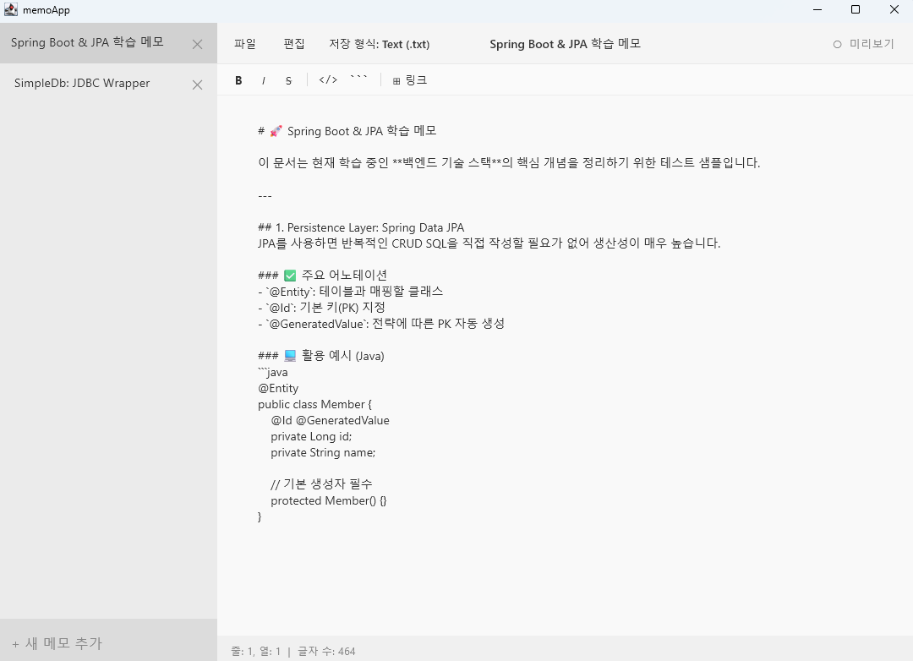
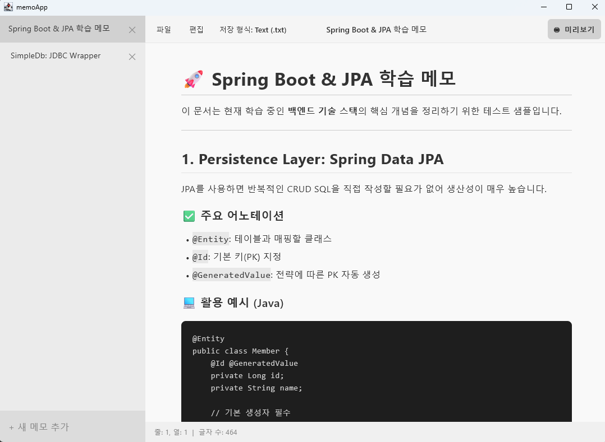
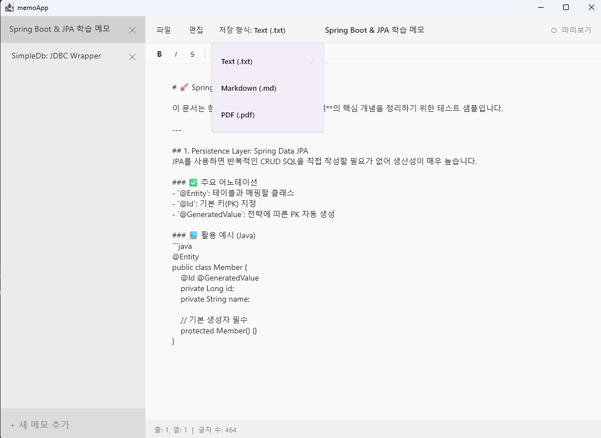

# memoApp

Compose Multiplatform으로 개발된 Windows 11 스타일의 마크다운 메모장입니다.
본 프로젝트는 **Claude Code**와 같은 AI 에이전트를 활용한 **'바이브 코딩(Vibe Coding)'** 방법론을 실무에 어떻게 적용하고 제어할 수 있는지 실험하고 연습하기 위해 진행되었습니다.

## 프로젝트 목적 (Vibe Coding Practice)
이 프로젝트의 핵심은 단순한 기능 구현을 넘어, 개발자가 AI에게 요구사항을 어떻게 전달(Prompting)하고, 생성된 코드를 어떻게 구조화하며, 발생한 버그를 AI와 어떻게 협업하여 해결하는지 등 **AI 에이전트와의 협업 워크플로우를 익히는 것**에 있습니다.

## 핵심 기능

### 1. Windows 11 네이티브 사용자 경험
* **Fluent Design**: 시스템 설정에 따른 라이트/다크 모드 및 Mica 효과 스타일 적용.
* **상태 표시줄**: 커서의 행/열 위치 및 전체 글자 수를 실시간으로 확인 가능.
* **표준 단축키**: `Ctrl+N`(새 메모), `Ctrl+O`(열기), `Ctrl+S`(저장) 등 윈도우 표준 단축키 지원.

### 2. 마크다운 편집 및 렌더링
* **실시간 미리보기**: `commonmark-java` 기반의 엔진으로 마크다운 요소를 즉시 렌더링.
* **스타일 지원**: 제목(H1~H3), 코드 블록, 인용구, 체크리스트 및 인라인 스타일(Bold, Italic 등) 구현.
* **편집 툴바**: 자주 사용하는 마크다운 문법을 클릭으로 삽입할 수 있는 퀵 툴바 제공.

### 3. 데이터 관리 및 확장성
* **자동 저장**: 앱 종료 시 현재 작업 중인 모든 메모와 상태를 로컬에 자동 보관.
* **다양한 내보내기**: 작성된 문서를 `.txt`, `.md` 뿐만 아니라 `OpenPDF`를 통해 `.pdf` 파일로 저장 가능.

## 기술 스택

* **Framework**: Compose Multiplatform (Desktop)
* **Language**: Kotlin
* **Libraries**:
  * `commonmark-java` (Markdown Parsing)
  * `OpenPDF` (PDF Generation)
  * `Kotlinx Coroutines` (Async I/O)
* **AI Agent**: Claude Code (Vibe Coding methodology)

## 개발 노트: Vibe Coding 워크플로우
1. **구조 설계**: 앱의 뼈대와 상태 관리 로직을 자연어 프롬프트로 정의하고 AI가 초안을 작성.
2. **반복적 개선**: 마크다운 렌더링 시 발생하는 텍스트 소실, 리스트 미표기 등의 버그를 AI와의 대화를 통해 실시간으로 디버깅 및 수정.
3. **UX 고도화**: 윈도우 11의 감성을 살리기 위한 패딩, 색상, 애니메이션 등의 디테일을 AI와 협업하여 조정.
4. **기능 통합**: 파일 시스템 접근 및 PDF 변환 라이브러리 연동 과정을 AI의 가이드를 받아 구현.

## 주요 화면

| 기능 | 스크린샷 |
| :--- | :--- |
| **메인 편집기** |  |
| **마크다운 미리보기** |  |
| **저장 형식 선택** |  |

## 실행 방법

### 요구 사항
* JDK 17 이상

### 빌드 및 실행
```bash
git clone [https://github.com/NIBble1492/mission--ai-builder--memo-app.git](https://github.com/NIBble1492/mission--ai-builder--memo-app.git)
cd mission--ai-builder--memo-app
./gradlew run